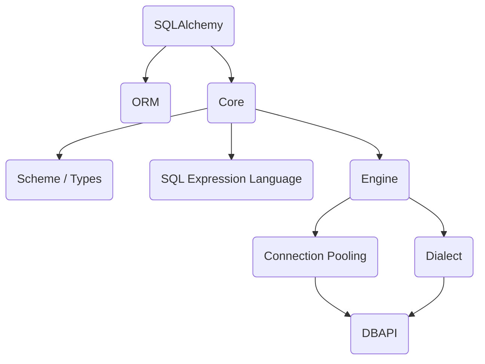

# SQLAlchemy


## Overview




**ORM vs CORE**

- Core/SQL Expression language is command oriented
- ORM is state oriented

### Installation 

```bash
# cython -- for speed
pip install cython

# default
pip install sqlalchemy

# with asyncio support
pip install "sqlalchemy[asyncio]"

```

